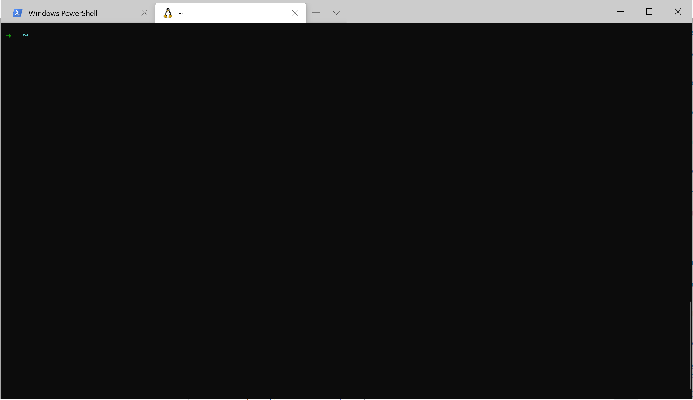

# SCCodes
Documents and examples for https://www.sccodes.org/

Check out the [setup guide](SetupGuide.md) for configuring Windows 10 :computer: with Visual Studio Code and Windows Terminal. All of the software is free. :free: This guide was setup to mimic the walkthrough for the [Front-End Basics](https://learning.sccodes.org/library/front-end-engineering/75813/path/) Setting up your mac for development so learners could have the same experience on Windows 10. 

Once you complete the setup, try the [Command Line Basics for Mac](https://learning.sccodes.org/library/command-line-basics-for-mac) course. As you are going through the course just remember Finder => [File Explorer](https://support.microsoft.com/en-us/help/17217/windows-10-whats-changed-in-file-explorer) and Terminal.app => [Windows Terminal](https://devblogs.microsoft.com/commandline/introducing-windows-terminal/). To get started in Windows Terminal (after you've followed the installation instructions of course)
1. Launch Windows Terminal
2. Select the dropdown next to ther terminal window
3. Select the WSL app you installed

4. Get started

As part of the install you will install [node.js](https://nodejs.org/en/) so the same setup will apply for the [Javascript Concepts](https://learning.sccodes.org/library/javascript-crash-course/) course (but really all you need is a browser). :smiley: :man_shrugging:  
